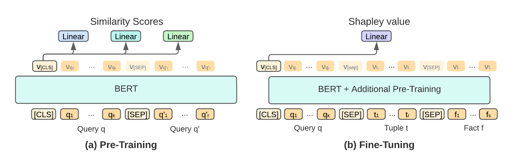

# LearnShapley
Implementation of LearnShapley - a system for ranking facts contributions based on query log
### Paper 
[paper title](arxivlink) 

## Abstract
LearnShapley employs Machine Learning to rank input facts based on their estimated contribution to query answers. We train a BERT-based model over DBShap, a new benchmark of queries, output tuples and contributing facts, for the task of ranking fact contribution. At inference time, LearnShapley is given a new query, an output tuple of interest, and its lineage (i.e. the set of all facts that have contributed in some way to the generation of the tuple). LearnShapley is able to leverage similarity measures applied to the query in hand and the queries stored in the training data, to compute a ranking of the tuples in the lineage based on their contribution. LearnShapley is thus a real-time alternative to ranking tuples based on algorithmic computation of Shapley values. 



## Prepare the Enviroment 
1. Clone this repository: 
```
git clone https://github.com/danaarad/LearnShapley.git
```

2. Install the dependencies:
```
conda create -n learnshapley python=3.7
conda activate learnshapley
cd LearnShapley
pip install -r requirement.txt
```
Install Pytorch. See [Pytorch](https://pytorch.org/) for the command for your system to install correct version of Pytorch.

## Prepare the Data
Download queries and tuples from [DBShap](https://www.cs.tau.ac.il/~danielde/dbshap_page/dbshap.html) and unzip into LearnShapley/data/<database_name>/, where <database_name> is either "academic" or "imdb".

```
python main.py --action=create_data --data=./data/<database_name> --dataset=<database_name> 

```
Additional configuration are avaliable, see main.py for details.


## Pre-Train LearnShapley
The pre-training stage of LearnShapley involves pre-training on prediction query similarities:
```
python main.py --action=train --model=pretraining --data=./data/<database_name> --dataset=<database_name> --save=<path_to_save_model> --epochs=20 --batch_size=32 --grad_accumulation=2 --use_sim_r --use_sim_w --use_sim_s

```
 --use_sim_<r,w,s> adds the relevant pre-training objective using this similarity function. The weight of each metric can be determaind with --sim_<r,w,s>_weight=<weight>.
 
 
 ## Fine Tuning LearnShapley
 We then fine-tune the model to predict Shapley values:
 ```
 python main.py --action=train --model=finetuning --lr=2e-5 --epochs=20 --batch_size=32 --save=<path_to_save> --grad_accumulation=2 --nhid=768 --use_sim_r --use_sim_s --use_sim_w --sim_checkpoint=<path_to_best_sim_checkpoint>  --data=./data/<database_name> --dataset=<database_name>
 ```

## Evaluation
The evaluation can be run as follows:
 ```
 python main.py --action=eval --model=finetuning --lr=2e-5 --epochs=10 --batch_size=32 --nhid=768  --data=./data/<database_name> --dataset=<database_name> --save=<path_to_save> --use_sim_r --use_sim_w --use_sim_s --eval_checkpoints=<path_to_checkpoints_dir> --sim_checkpoint=<path_to_best_sim_checkpoint> --eval_split=<dev,test> 
 
 ```

